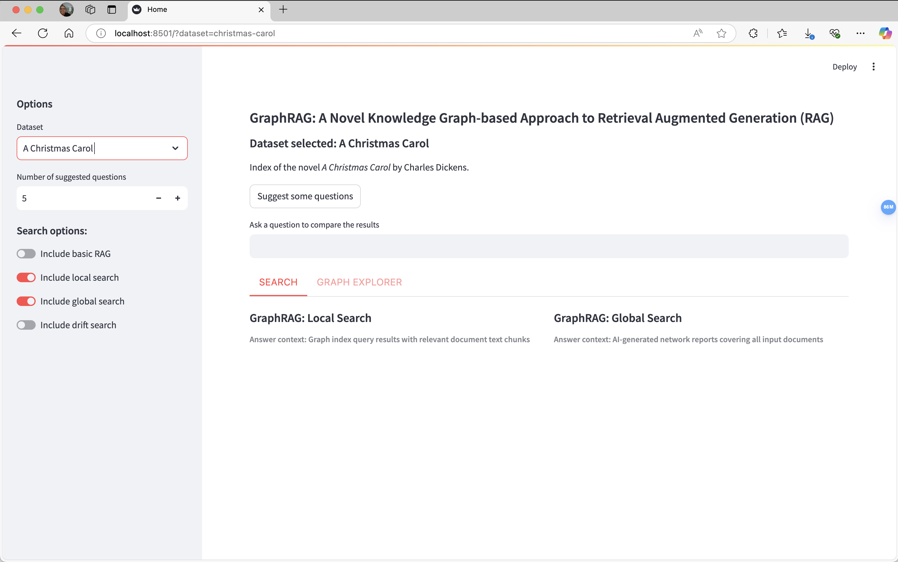

# GraphRAG-KnowledgeBase — 基于 GraphRAG 的知识库检索系统

[](https://python.org/)
[](https://github.com/microsoft/graphrag)
[](https://lancedb.com/)
[](LICENSE)

## 项目背景

传统的文档检索方式（如关键词搜索）在面对大量非结构化文档时，很难理解文档间的关联关系和上下文语义。用户提出一个复杂问题，往往需要翻阅多份文档才能拼凑出答案，效率很低。

本项目基于微软的 [GraphRAG](https://github.com/microsoft/graphrag) 框架，构建了一个知识图谱驱动的 RAG（检索增强生成）系统。系统先对文档进行实体抽取和关系建模，生成知识图谱，再结合大语言模型进行问答。相比普通 RAG，知识图谱能捕获文档间的深层关联，回答更准确、更完整。

项目还集成了一个统一搜索前端应用（`unified-search-app`），提供可视化的检索界面。

## 效果展示

### 搜索界面
支持 Local Search（局部上下文检索）和 Global Search（全局摘要检索）两种模式，可切换检索策略。



### 知识图谱浏览器
Graph Explorer 可视化展示文档中抽取的实体和社区关系，支持按社区层级筛选和查看详细报告。


## 核心能力

- **知识图谱构建：** 自动从文档中抽取实体和关系，构建知识图谱索引
- **双模式检索：** 支持 Global（全局摘要）和 Local（局部上下文）两种检索模式
- **流式输出：** 结合大语言模型的流式回答，实时返回检索结果
- **LanceDB 存储：** 使用 LanceDB 向量数据库存储嵌入，支持高效相似度检索
- **Web 搜索前端：** 基于 Docker 部署的统一搜索应用

## 项目结构

```
GraphRAG-KnowledgeBase/
├── graphrag/                   # GraphRAG 核心框架代码
├── ragtest/                    # 知识库实例配置
│   ├── input/                  # 输入文档目录
│   ├── output/                 # 索引输出（知识图谱）
│   ├── cache/                  # 索引缓存
│   ├── prompts/                # 自定义提示词
│   └── settings.yaml           # 索引和查询配置
├── unified-search-app/         # 搜索前端应用
│   ├── app/                    # 应用代码
│   ├── Dockerfile              # 容器化部署
│   └── pyproject.toml
├── docs/                       # 框架文档
├── examples_notebooks/         # 使用示例
├── tests/                      # 测试用例
├── pyproject.toml              # 项目依赖配置
└── 命令.txt                     # 常用命令参考
```

## 快速开始

**环境要求：** Python 3.10+、大语言模型 API（如 OpenAI 或本地部署的模型）

```bash
# 安装依赖
pip install poetry
poetry install

# 准备文档（放入 ragtest/input 目录）

# 构建知识图谱索引
python -m graphrag index --root ./ragtest

# 全局检索
python -m graphrag query --root ./ragtest --method global --query "你的问题" --streaming

# 局部检索
python -m graphrag query --root ./ragtest --method local --query "你的问题"
```

## 配置说明

核心配置在 `ragtest/settings.yaml`，需要配置：
- LLM 模型接口地址和 API Key
- 嵌入模型配置
- 文档分块策略
- 索引存储路径

> 本项目基于 [Microsoft GraphRAG](https://github.com/microsoft/graphrag) 框架二次开发，原项目采用 MIT 协议。

## 开源协议

MIT License
