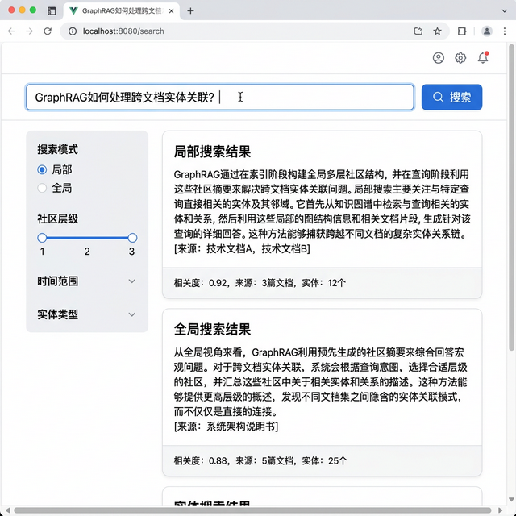
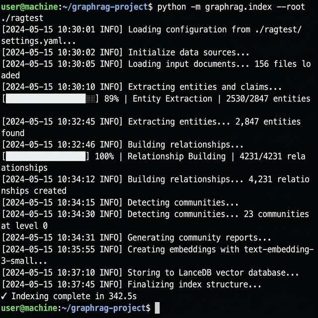
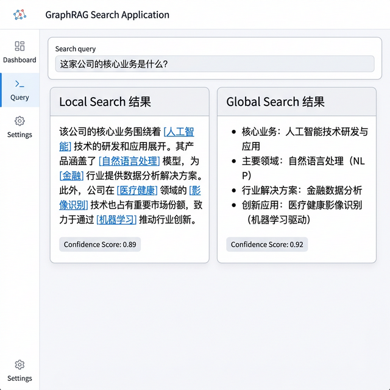
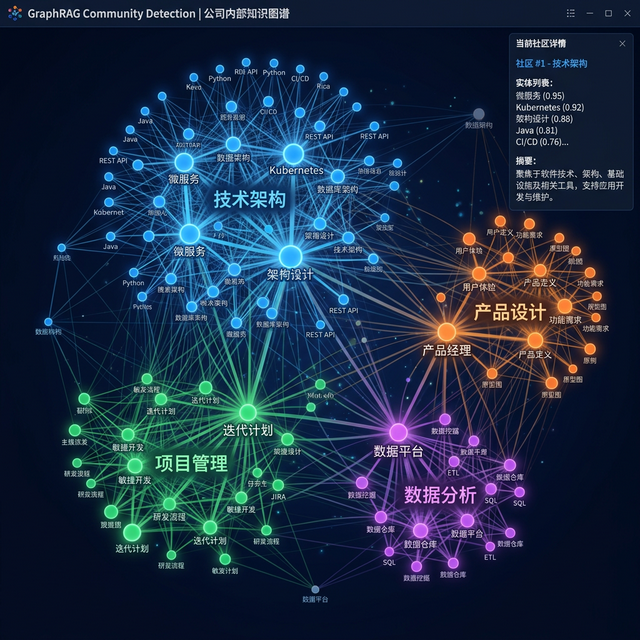
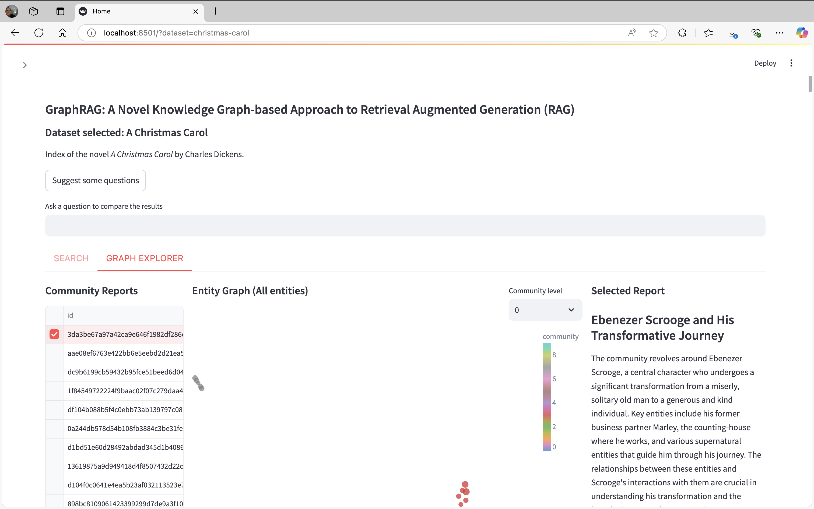

# GraphRAG 知识库检索系统

 


> 基于微软 GraphRAG 的知识图谱增强检索系统 · LanceDB 向量数据库 · 局部/全局双模式搜索

## 项目目的

传统 RAG（检索增强生成）基于向量相似度匹配文本片段，无法理解实体间的深层关联。本项目基于 微软 GraphRAG 框架，通过构建知识图谱提取实体和关系，利用社区检测算法组织信息结构，实现跨文档的语义理解和推理，显著提升复杂问题的回答质量。

## 解决的痛点

- 传统 RAG 仅做浅层文本匹配，无法回答需要跨文档推理的问题
- 知识图谱构建和维护成本高
- 向量检索缺少对实体关系的建模
- 大规模文档库中信息碎片化，缺乏全局视角

## 系统效果展示

### 搜索查询界面

支持自然语言输入，同时展示局部搜索和全局搜索结果。



### 索引构建过程

终端展示文档加载、实体提取、关系构建、社区检测的完整索引流程。



### 检索结果对比

局部搜索与全局搜索的不同检索策略对比展示。



### 知识图谱社区结构

GraphRAG 自动发现的实体社区可视化，不同颜色表示不同主题聚类。



### 知识图谱浏览器

交互式知识图谱可视化，展示实体节点和关系边。



## 技术架构

| 模块 | 技术方案 |
|------|---------|
| 图谱构建 | Microsoft GraphRAG + LLM 实体提取 |
| 向量存储 | LanceDB 本地向量数据库 |
| 社区检测 | Leiden 算法层次化聚类 |
| 嵌入模型 | text-embedding-3-small |
| LLM 推理 | GPT-4o / GPT-4o-mini |
| 前端检索 | Streamlit / Vue.js |

## 搜索模式

### 局部搜索（Local Search）
- 从查询实体出发，沿知识图谱边遍历
- 适合有明确实体的精确查询
- 返回与查询实体直接相关的上下文

### 全局搜索（Global Search）
- 基于社区检测的层次化摘要
- 适合需要全局概览的开放性问题
- 融合多个社区的信息形成综合回答

## 快速开始

```bash
git clone https://github.com/xiaofuqing13/GraphRAG-KnowledgeBase.git
cd GraphRAG-KnowledgeBase

pip install graphrag lancedb

# 初始化项目
python -m graphrag init --root ./ragtest

# 构建索引
python -m graphrag index --root ./ragtest

# 局部搜索
python -m graphrag query --root ./ragtest --method local --query "查询内容"

# 全局搜索
python -m graphrag query --root ./ragtest --method global --query "查询内容"
```

## 项目结构

```
GraphRAG-KnowledgeBase/
├── ragtest/             # GraphRAG 工作目录
│   ├── input/           # 输入文档
│   ├── output/          # 索引输出
│   └── settings.yaml    # 配置文件
├── frontend/            # 搜索前端
├── scripts/             # 工具脚本
└── docs/                # 文档截图
```

## 开源协议

MIT 许可证
